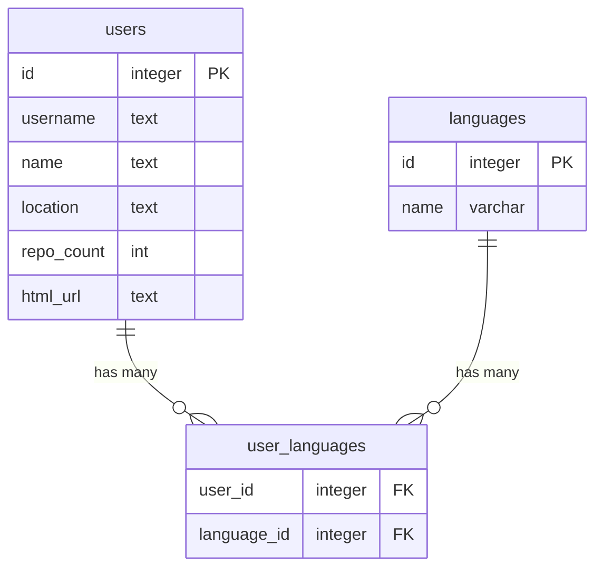

# LovelyStay CLI

## How to install and run

### Prerequisites

Install

- [Node.js](https://nodejs.org)
- [Docker](https://www.docker.com/)
- [Node Version Manager](https://github.com/nvm-sh/nvm)
- [pnpm](https://pnpm.io/)

### Install and run

1. Run `nvm install` to install the Node version specified in `.nvmrc`
2. Run `pnpm install` to install the dependencies.
3. Create a `.env` file in the format of `.env.example` and fill in the values. The env.example has the values to run with the docker-compose file.
4. Run `docker compose up` to start the Postgres database and run the migrations using [Goose](https://github.com/pressly/goose)
   For details, see `docker-compose.yml`
5. Run `pnpm seed` to run a script that will fetch all [languages](https://raw.githubusercontent.com/github/linguist/master/lib/linguist/languages.yml) compatible Github and save them to the database.

### CLI Examples

Commands to run the app

Save a user fetched from github

```bash
lscli save octocat
```

Fetch all users

```bash
lscli list
```

List users filtered by a language

```bash
lscli list --language TypeScript
```

List users filtered by a location

```bash
lscli list --location Lisbon
```

## Develop

### Test

Commands to run tests

```bash
# unit tests
pnpm run test
```

FOr testing we are using [Jest](https://jestjs.io/) and [TestContainers](https://www.testcontainers.org/)

## Documentation

### Database

The database is a Postgres database with the following schema:


