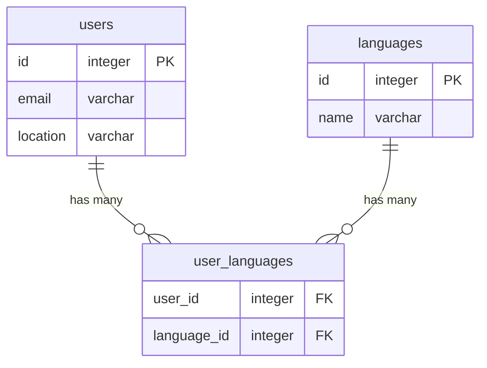

# LovelyStay CLI

## How to install and run

### Prerequisites

Install

- [Node.js](https://nodejs.org)
- [Docker](https://www.docker.com/)
- [Node Version Manager](https://github.com/nvm-sh/nvm)
- [pnpm](https://pnpm.io/)

### Install and run

1. Run `nvm install` to install the Node version specified in `.nvmrc`
2. Run `pnpm install` to install the dependencies.
3. Run `docker compose up` to start the Postgres database
   For details, see `docker-compose.yml`
4. Run `pnpm config` to config the CLI

### CLI Examples

Commands to run the app

Save a user  fetched from github

```bash
lscli save example@mail.com
```

Fetch all users

```bash
lscli fetch
```

Fetch users filtered by a language

```bash
lscli fetch --language=javascript
```

Fetch users filtered by a location

```bash
lscli fetch --location=Portugal
```

## Develop

### Test

Commands to run tests

```bash
# unit tests
pnpm run test
```

## Documentation

### Database

The database is a Postgres database with the following schema:


